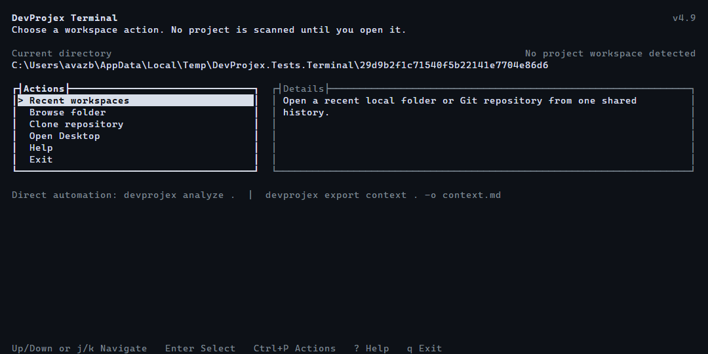
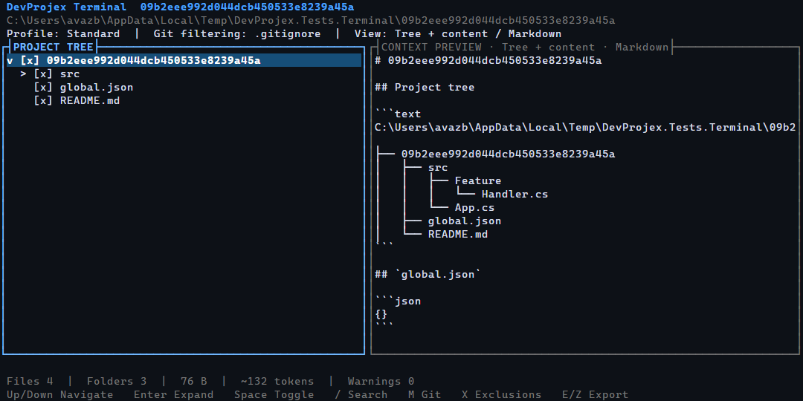

# DevProjex Terminal Workspace

DevProjex Terminal is the interactive terminal interface included in the same
portable executable as DevProjex Desktop.

## Start

```shell
devprojex
devprojex tui .
devprojex tui ./app --screen inline
```

The argument-less command starts the workspace only when stdin and stdout are
interactive and `TERM` is not `dumb`. `devprojex tui` fails with a usage error
instead of blocking when the terminal is redirected.

The workspace applies saved project settings when they exist and otherwise uses
the deterministic default settings. The `standard`, `local`, and portable-file
names remain part of the CLI profile contract, not permanent TUI jargon.

## Welcome

Welcome shows up to nine recent projects inline; `1` through `9` open them
directly. **Open portable profile** is a first-class visible action. The footer
advertises `:`, and the Welcome command line accepts `recent`, `language`,
`help`, and `quit`.

The welcome screen offers:

- open the current directory when it is a reasonable project candidate;
- open Recent Workspaces, combining local folders and Git repositories;
- browse for a folder;
- clone through the existing DevProjex Git service;
- open DevProjex Desktop;
- help and exit.

DevProjex does not automatically scan a filesystem root, a broad home directory,
or another unsafe default location.

Opening a project from Welcome uses saved project settings when they exist and
deterministic defaults otherwise. Recent Workspaces, Browse, Clone, and Help are
nested workflows: canceling or closing them returns to Welcome without ending
the terminal session. Opening a project with a portable settings file remains
available as an advanced Action Palette workflow.

Recent Workspaces reads and updates the same per-user history as Desktop. Its
initial folder-and-repository projection performs no Git process, cache scan, or
network request. Selecting an available entry shows a loading state and opens its
workspace without ending the TUI. A successfully opened entry moves to the front
of the existing history. Unavailable entries remain visible so they can be
removed intentionally.

If recent-project storage is temporarily locked, the workflow offers Retry
instead of presenting an empty list. A valid backup is used when the primary
history is corrupt. An invalid local-profile store offers a deterministic
Standard-profile recovery path; unavailable roots or file types in an otherwise
valid local profile open with diagnostics.

Repository rows come from the repository history in that same store. Cache
resolution is deferred until a row is opened. A healthy cached clone opens
without a network request. A missing or damaged cache remains visible and offers
explicit Back, Remove, or Clone Again actions. Removing history never silently
deletes a cache. Equivalent supported repository URLs are normalized to avoid
duplicate rows.

Cloned workspaces use repository identity rather than the physical cache folder:
the heading, tree root, Preview, analysis, and context documents show the clean
repository name and original safe URL. Source details show the safe URL, branch,
short commit, human-readable size, and last-opened time without exposing the
physical cache path. Clone progress shows the repository, safe URL, elapsed time,
current Git phase and real Git measurements when Git provides them; it never
manufactures a percentage or prints credentials.

## Navigation Lifecycle

The Terminal Workspace runs under one persistent application root. Dialogs and
secondary screens are overlays over that root; closing an overlay restores the
previous screen, selected row, and keyboard focus.

- Enter opens or confirms the focused action.
- Esc cancels active work, closes the command line or overlay, clears the active
  Tree filter or Preview search, and otherwise asks before returning from a
  workspace to Welcome.
- Ctrl+C cancels active work first and otherwise asks before exiting.
- `q` exits only from a root screen.
- Errors remain visible until dismissed and then return to a usable prior state.

Only an explicit Exit action, root-level `q`, or confirmed Ctrl+C ends the TUI.
Opening Desktop reports the handoff result instead of silently terminating the
Terminal Workspace.

## Interface

The Welcome screen uses the terminal background, a compact action list, a
focused detail pane, and contextual keyboard hints instead of a modal selector.



After a project opens, the wide layout keeps Project Tree, Context Preview, and
Parameters visible together. Parameters uses a fixed 38-column panel so excess
width belongs to Preview. Parameters starts directly with three framed mini-panels:
Content Processing, Exclusions, and File Types. Content Processing contains five
fixed rows; Exclusions and File Types divide the remaining height and scroll
independently. Their aggregate All controls remain fixed in the top frame while
the lists scroll; plain mode renders the same controls as pinned first rows.
Only the focused mini-panel renders a selection highlight. Narrow layouts present
the same three mini-panels at the full
available width without losing selection or navigation state. Export commands
remain available from their shortcuts and the Action Palette instead of being
mixed into the settings lists.



## Layout

The workspace adapts to terminal size:

| Width | Layout |
|---:|---|
| 150 columns or wider | Tree, Preview, and Parameters |
| 120-149 columns | Tree and Preview; Parameters opens as a focused pane |
| 80-119 columns | tabbed single-pane workspace |
| 60-79 columns | compact single-pane workspace |
| below 60 columns, or below 20 rows | resize guidance |

If the terminal is too small to operate safely, the workspace shows a compact
size hint rather than corrupting the screen.

## Workflow

The workspace supports:

- lazy tree expansion and tri-state selection;
- keyboard and mouse navigation;
- a visible Tree Filter and a separate Preview Search;
- extension selection;
- a five-value Git radio group for none, `.gitignore`, tracked, staged, and all
  working-tree changes; an active command-line diff scope appears as a sixth row;
- ordinary Exclusions independent from Git filtering;
- all five content-processing options: Hide Secrets, Hide Private Data,
  Compress Code, Strip Comments, and Strip Blank Lines;
- redaction counters for Hide Secrets and Hide Private Data after the current
  selection is scanned;
- tree, content, and tree-plus-content preview;
- ASCII, JSON, XML, and Markdown formats;
- file, folder, character, token, and byte metrics;
- saved project settings and portable settings files;
- context, exact-folder, and ZIP export;
- dry-run summaries and cancellation;
- opening the current state in Desktop.

Tracked, staged, changes, and diff modes use the installed Git CLI. On startup,
an unavailable selection does not open the workspace. If an interactive mode
change cannot resolve the requested Git state, TUI keeps the last usable Git
mode. It never silently substitutes `.gitignore` or an unfiltered tree. Staged,
changes, and diff are session-only; portable profile saves reject them rather
than persist a stale snapshot. Their content is read from the current working
tree, while all other selection and exclusion rules continue to narrow files.

`Ctrl+P` opens a searchable Action Palette from Welcome or the workspace.
Important features do not depend on memorizing letter shortcuts: the palette and
Parameters and visible action bars call the same workspace action registry as
keyboard shortcuts and the workspace command line, then restore the previous pane
when canceled. Workspace palette rows show the corresponding `:` syntax when the
action has a command-line form.

Changing checked nodes updates the selection projection without rescanning the
filesystem. Structural changes use the canonical refresh pipeline. Preview
refresh is cancelable, debounced, and bounded for large projects.

Parameters apply immediately in Terminal Workspace, so it intentionally has no
Apply command. Rapid changes are coalesced into the latest requested state;
batch-oriented workflows belong to direct CLI commands rather than a second
commit model inside the TUI.

When filtering changes which options are available, a newly discovered option is
selected by default. An option already seen during the session keeps its explicit
checked or unchecked state if it disappears and later returns. This is the same
selection-evolution policy used by Desktop.

If the effective filters leave the project without visible descendants, the
real project root remains in the tree. A dim, non-selectable hint directs the
user to File Types and Exclusions, and the status metrics report zero files,
folders, and tokens. Restoring the selection removes the hint and restores the
same tree rows.

Non-blocking settings, Git-mode, selection-projection, parameter-availability,
and Preview refreshes use a reserved slot at the right of the workspace heading.
The slot appears only after 200 ms, is limited to 24 terminal columns, and takes
priority over the project title when space is constrained. It disappears as
soon as the work completes. Plain mode uses static text, and the too-small view
does not render the slot. Cloning, repository updates, branch switching, and
exports remain blocking operations and retain the modal progress surface.

## Workspace Command Line

Press `:` on Welcome or while Project Tree, Context Preview, or Parameters has normal focus to
replace the contextual footer with the workspace command line. It controls the
current live session; it is not a nested invocation of the direct DevProjex CLI.
Dialogs and overlays keep ownership of their input, and the command line is not
available in the too-small layout.

Command verbs and choice tokens are stable English identifiers shared with the
direct CLI presentation catalog. They are intentionally not localized. Argument
schemas, help, completion hints, results, and errors are localized. Resolution is
strict: only a complete token executes. Tab accepts or cycles completion, while an
invalid token reports its position and up to three similar candidates. Arguments
containing whitespace can use single or double quotes; path completion inserts
and preserves the required quotes automatically.
Welcome exposes the focused subset `recent`, `language`, `help`, and `quit`.

| Syntax | Session action |
|---|---|
| `set <option> on\|off` | toggle one content or exclusion option; legacy `set gitignore` and `set tracked` remain supported |
| `set git off\|gitignore\|tracked\|staged\|changes\|diff:<ref>..<ref>` | select the Git axis without changing profiles |
| `all types\|exclusions\|content on\|off` | apply the framed **All** action |
| `type <.ext> [<.ext>...] on\|off` | toggle available file extensions |
| `view tree\|content\|tree-content` | select Preview mode |
| `format text\|markdown\|json\|xml` | select tree format |
| `search [text]` | search Preview, or clear it with no text |
| `filter [text]` | filter Project Tree, or clear it with no text |
| `export context [format] [path]` | open the existing context-export confirmation |
| `export zip <path>` / `export folder <path>` | open the existing project-export confirmation |
| `copy [tree\|content\|tree-content] [text\|markdown\|json\|xml]` | copy an exact context document without changing the current view or format |
| `analyze` | analyze the current context |
| `branch [name]` | switch the cloned repository branch, or open branch selection |
| `update` | get updates for the cloned repository |
| `recent` | open recent projects and repositories |
| `profile save [name]` | save the current settings as a portable profile |
| `refresh` | rescan the working copy from disk without network access |
| `language [code]` | show available language codes or switch the workspace language immediately |
| `diagnostics` | show every diagnostic in a scrollable overlay |
| `help [verb]` | open the localized command cheat sheet |
| `quit` | perform the same safe exit action as `q` |

`set git none` is accepted as a synonym for `set git off`; command help and
completion continue to advertise the shorter `off` form.

Examples:

```text
:set hide-secrets on
:set git staged
:set git diff:main..feature
:all types off
:type .cs .md on
:view content
:search "connection string"
:copy content markdown
:refresh
:language ja
:export context markdown "../review context.md"
```

`copy` first uses the platform clipboard exposed by Terminal.Gui. When that is not
available, an interactive terminal receives a complete OSC 52 clipboard sequence.
Oversized OSC 52 payloads are never truncated; the command reports an error and
directs the user to `export` instead. A view or format supplied to `copy` applies
only to that operation.

Left/Right, Home/End, Backspace, and Delete edit the line. Esc cancels it,
Enter executes it, and Up/Down traverses command history. The newest 50 commands
are persisted in terminal settings across launches; adjacent duplicates are stored
once. A ghost suffix previews completion without changing the input. Plain mode
renders that hint in brackets instead of relying on dim color.

Debounced tree selection, expansion, focus, view, and format state is flushed
before leaving a workspace or exiting, so an immediate exit cannot discard the
last accepted interaction.

`language` without an argument shows the current language and all supported codes.
A mistyped code reports only the nearest candidates and points back to the
argument-free command for the complete list.
A language selected with `:language` is stored for future Terminal Workspace
sessions. An explicit `--language` option overrides it for one launch without
changing the stored choice; otherwise the workspace uses the stored choice and
then falls back to system-language detection. Desktop language settings remain
independent.

Single-line successful results temporarily occupy the footer. Errors remain until
the next key press, and multiline results use a scrollable overlay instead of
being flattened. Settings
commands use the same optimistic update, cancellation/coalescing, corner progress,
and rollback path as mouse and keyboard changes in Parameters. Export commands use
the existing confirmation and blocking progress surfaces.

## Keys

| Key | Action |
|---|---|
| Up / Down | navigate |
| Left / Right | collapse / expand |
| Shift+Left / Shift+Right | collapse / expand the complete tree |
| Ctrl+A / Ctrl+U | select all / select none in the tree |
| `R` | reveal a project path in the tree |
| Enter | open or activate |
| Space | toggle the selected node |
| `/` | search |
| `:` | open the workspace command line |
| Ctrl+P | searchable Action Palette |
| Tab / F6 | focus the next major pane |
| Shift+Tab / Shift+F6 | focus the previous major pane |
| `1`, `2`, `3` | tree, content, tree plus content |
| `F` | format |
| `C` | focus Content transformations |
| `M` | cycle Git mode: none → gitignore → tracked → staged → changes |
| `X` | focus Exclusions |
| `T` | focus File Types |
| `E` | export context |
| `z` / Shift+`Z` | export folder / ZIP |
| `P` | save the current selection as a portable profile |
| `D` | show diagnostics |
| `A` | analyze |
| `G` | open Desktop |
| F1 or `?` | help |
| Esc | cancel work; close an overlay; clear the active filter/search; otherwise confirm return to Welcome |
| `q` | quit |

The footer shows actions relevant to the active layout.

When Context Preview has focus, Up/Down and `j`/`k` scroll by line,
Page Up/Page Down scroll by page, and Home/End move to the start or end.
Left/Right scroll horizontally when content overflows. `{` and `}` move to the
previous or next file section, Ctrl+G jumps to a line, and `W` toggles line
wrapping. Changing the selected tree file scrolls Preview to that file after a
short debounce. In compact layouts, moving focus also makes the corresponding
Tree, Preview, or Parameters pane visible. Pane
focus and preview position survive Help, settings overlays, refreshes, exports,
cancellation, and terminal resize.

Tree selection, expanded folders, Preview view/format, and the focused path are
stored per canonical project root. The settings store retains the 32 most
recently used project entries. In split layouts the Parameters area remains
visible as a collapsed aggregate strip; a wide but low terminal uses the
two-panel layout instead of squeezing three panes.

Path pickers include an editable path field above the list. `~`, environment
variables, relative paths, and Tab completion are supported. Command-line export
destinations use filesystem completion from the active project directory. A
nonempty typed path that does not exist remains in the open picker with a
localized error; it is never replaced by the current folder or highlighted file.

Clicking anywhere on a tree or parameter row toggles its checkbox; double-clicking
a folder expands or collapses it.

Within Parameters, Up/Down and `j`/`k` move through the active mini-list. At a
list boundary focus crosses to the adjacent mini-panel. Enter or Space toggles
the selected row. Exclusions and File Types each expose an independent vertical
scrollbar only when their content overflows. Project Tree exposes vertical and
horizontal scrollbars under the same overflow-only policy. Parameter rows begin
at the inner edge of their mini-panel; no padding from the former flat list is
retained.

When Hide Secrets has findings, `[` and `]` move between highlighted occurrences;
`Enter` or `Space` toggles keep-as-is for the active occurrence. That decision is
used by every output in the current session and is not saved in the project profile.

## Preview

The regular Preview follows the Desktop model: Tree, Content, or Tree + Content
in ASCII, JSON, XML, or Markdown. It is optimized for inspection and does not
show export-document scaffolding such as Markdown headings and fences. The active
mode and format are always visible. Exact context-export output remains available
as an advanced Action Palette action and is never presented as if it were the
regular Preview.

Large contexts use the shared preview document abstractions. Small documents
stay in memory; larger documents use temporary file-backed UTF-8 storage with
line and file-section indexes. The viewport reads only visible lines, Preview
Search scans the indexed document, and Home/End can reach the first and final
selected files. Preview Search starts at two Unicode runes and keeps at most
10,000 matches; a capped result displays `10000+` and navigation wraps through
the loaded matches. Word wrapping never splits a wide terminal glyph between
visual rows. The range line reports visible
files/sections, lines, columns, and totals, so partial visibility is never
silent. Rapid changes cancel stale Preview work, and retired temporary documents
are disposed after the replacement is active.

Vertical and horizontal scrollbars are thin, neutral, and separate from operation
progress. Each appears only for real overflow; horizontal position remains
keyboard and mouse navigable without a progress-colored bar.

## Screen Safety

`--screen auto` selects an appropriate screen mode from terminal capabilities and
environment signals such as `TMUX`, `ZELLIJ`, `TERM`, and redirection.

- `alternate` uses a full-screen alternate buffer.
- `inline` keeps the main buffer and preserves scrollback where possible.

Normal exit, cancellation, and unhandled failure restore the cursor, colors,
mouse mode, terminal settings, and alternate screen through a `try/finally`
boundary.

`--no-mouse`, `--color never`, and `--plain` provide conservative fallbacks.
`NO_COLOR`, `TERM=dumb`, redirected streams, and CI are also respected.

Native macOS TUI validation covers published startup, keyboard navigation,
resize, normal exit, and observable parent-shell usability. Extended `Ctrl+Z`
and job-control scenarios are not part of the certified contract.

Terminal.Gui 2.4.17 may briefly emit a mouse-enable sequence while initializing
its ANSI driver, before DevProjex applies `--no-mouse`. In `--no-mouse` sessions,
DevProjex disables tracking before normal input, ignores mouse events, and
restores the terminal on exit. Release validation checks observable behavior and
shell usability; it does not promise that Terminal.Gui emits no initialization
sequence at all. The upstream behavior is documented in the
[pinned implementation](https://github.com/tui-cs/Terminal.Gui/blob/d0a0ed9b150d3fc8aacf4ab07b7f7d91264fe6d6/Terminal.Gui/Drivers/AnsiDriver/AnsiOutput.cs#L128-L150).

## Export

The export summary asks whether to export and presents a compact aligned
table containing destination, file and folder counts, size, estimated tokens,
filters, diagnostics, and an inline redaction warning when applicable. Export is
the default action. A destination conflict offers **Overwrite** directly in the
summary. Successful exports do
not open another dialog; the result path appears transiently in the status bar.

When redaction is enabled, the project-copy summary states that matching text
will change, binary files will remain unchanged, and the folder or ZIP may not
build or run. Keep-as-is decisions made in Preview also apply to the output.

Context, project-copy, ZIP, and portable-profile destinations use the same
canonical outside-source and existing-parent policy as direct commands. The
suggested export path uses the external current directory only after the same
canonical source-safety check; otherwise it uses a separately validated sibling
of the source. If neither location can be established safely, no default is
suggested. A filesystem alias into the source is never suggested.
When an external alias remains stable after canonical safety validation, the
suggestion keeps the user's absolute path spelling instead of exposing an
equivalent physical-system alias.

Folder and ZIP exports use measured progress from the shared copy engine:
processed entries, total entries, percentage, written bytes, elapsed time, and
the real operation phase. Context preparation and document writing use an
indeterminate status because those stages do not expose a trustworthy total.
DevProjex never manufactures a percentage.

Repository cloning and project loading use the same operation surface. Stages
without an honest total remain indeterminate and show their current phase;
measured Git object/transfer progress is shown only when emitted by Git.
Explicit Clone actions use the shared managed repository cache and its operation
lease. Reopening an equivalent URL reuses and refreshes the existing cache, and
concurrent clone requests cannot publish duplicate repository containers.

Esc or Ctrl+C cancels active export work before it can quit the TUI. Cancellation
removes staging data and returns to the same usable workspace and pane focus.
Completion returns directly to the workspace and reports the output path in the
status bar without interrupting keyboard navigation.

For very large explicit selections, save a portable profile and use
`--profile FILE` instead of producing a command with hundreds of `--select`
arguments.
