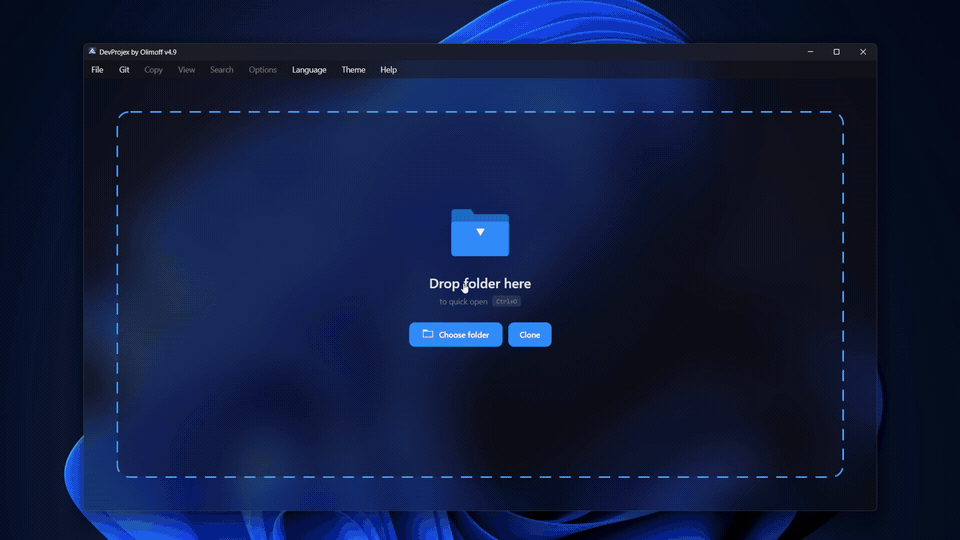

<h1 align="center">DevProjex 📁🌳</h1>

<h2 align="center">🏆 Officially Selected by the Avalonia UI Team for the <a href="https://avaloniaui.net/showcase">App Showcase</a></h2>

<p align="center">
  <a href="https://github.com/Avazbek22/DevProjex/releases"></a>
  <a href="https://github.com/Avazbek22/DevProjex/actions"></a>
  <a href="LICENSE"></a>
  
  
</p>

<p align="center">
  <strong>Turn a real codebase into clean, AI-ready context — and see exactly what you're sending.</strong>
</p>

DevProjex turns any folder or codebase into clean, ready-to-use context for AI chats, code reviews, and documentation. Use it as a **GUI**, a **TUI**, a **CLI**, or an **MCP server** for AI agents — whatever fits your workflow.

Choose what you need in an interactive file tree, check the result in a live preview, then export it as **ASCII, Markdown, JSON, or XML**. Need more than text? Export a real copy of your project — a clean **folder or ZIP file** — with the same filters applied.

> 🔒 **Read-only and telemetry-free by design.** DevProjex does not upload your project contents or collect telemetry.

---

## App Demo 🖼️



---

## Download 🚀

**Download from Microsoft Store:**
👉 [DevProjex](https://apps.microsoft.com/detail/9ndq3nq5m354)

**Latest GitHub release:**
👉 [https://github.com/Avazbek22/DevProjex/releases/latest](https://github.com/Avazbek22/DevProjex/releases/latest)

**Linux AppImage (x86_64 and aarch64):** [download it from GitHub Releases](https://github.com/Avazbek22/DevProjex/releases/latest)

**Install via WinGet (Windows):** `winget install OlimoffDev.DevProjex`

All install options per OS are covered in [Docs/Installation.md](Docs/Installation.md).

### Run without installing

These headless channels are available from release v5.2. Until the v5.2 packages
have completed their first publication, use the direct GitHub release binary.

```shell
npx devprojex tree .
dnx devprojex tree .
./DevProjex tree .
```

The npm and NuGet packages contain the CLI, TUI, and MCP server, but not the
desktop application. See [Docs/Installation.md](Docs/Installation.md) for the
Node/.NET requirements and supported platforms.

Release automation also prepares direct headless archives and a non-root Docker
image; their commands and availability boundary are documented in
[Docs/Installation.md](Docs/Installation.md).

---

## Why DevProjex? 💡

Copying files into a chat window one by one **doesn't scale**. CLI tools pack a whole project fast, but you **can't see what you're sending** before it's sent.

DevProjex works differently — visual, precise, and local-first:

* **You see what leaves your project** — file tree, live preview, token estimate
* **You control what leaves it** — Smart Ignore, Git modes, secret and private-data redaction, name filters, saved profiles
* **You get more than text** — a real project copy as a folder or ZIP

### Use it for

* **AI assistants** — clean input for ChatGPT, Claude, DeepSeek, Qwen, Kimi
* **AI agents** — Claude Code, Cursor, or any MCP client inspects your project through a read-only, always-redacted server
* **CI pipelines** — fail a build when secrets would leak into packed context, without ever printing the values
* **Restricted environments** where AI agents, remote indexing, or IDE plugins aren't allowed
* **Code reviews** — share structure and only the files that matter
* **Large codebases** — pull out one module instead of the whole repo
* **Teaching** — explain a project's architecture to a teammate or student

### Get started

1. **Open or drop** a project folder.
2. **Choose** folders, files, filters, ignore rules, and output mode.
3. **Preview**, then copy, export, or run the same workflow from the terminal.

Works with any language, repository, or project structure.

---

## Feature overview ✨

**Choose and control**
* **Smart Ignore** — hides build output, dependency folders, and caches, and checks for evidence before hiding anything. [How it works ↓](#how-smart-ignore-works-)
* **Hide Secrets** — masks detected credential values in everything you export. [How it works ↓](#how-hide-secrets-and-hide-private-data-work-)
* **Hide private data** — optionally masks emails, IPs, MACs, phones, and user paths. [How it works ↓](#how-hide-secrets-and-hide-private-data-work-)
* **Code compression** — keeps declarations and signatures, empties implementation bodies; pure code gets ~3× smaller. [How it works ↓](#how-code-compression-works-)
* **Strip comments** and **strip blank lines** — syntax-aware cleanup across 20 language packs, without modifying source files
* File tree with checkboxes, search, and name filters
* Git-aware scopes for `.gitignore`, tracked files, staged files, all current changes, or a ref-to-ref diff

**Preview and export**
* Live preview (tree / content / both) before you copy or export
* Scrollbar markers show search matches and redaction findings at a glance
* Export as ASCII, Markdown, JSON, or XML
* Save to file or clipboard — tree only, content only, or both
* Export a clean copy of your project to a folder or ZIP archive

**Workflow**
* GUI, TUI, CLI, and MCP server — the same engine, four ways to work
* Git tools built in: clone by URL, switch branches, update cached copies
* Local profiles remember your settings per project
* Live counters for lines, characters, and estimated tokens
* Progress bar with safe cancellation

**Interface**
* Light, dark, and system themes, with transparency and blur where supported
* Platform-native keyboard shortcuts — ⌘-based on macOS, Ctrl-based on Windows and Linux
* Tree context menu — reveal in the file manager, copy paths or transformed contents, select one item, expand or collapse a branch
* Localization in 20 languages
* Stays smooth even on very large folders

---

## DevProjex vs the alternatives ⚖️

| Feature | DevProjex | Repomix | gitingest | code2prompt | GPTree | files-to-prompt |
|---|---|---|---|---|---|---|
| GUI + TUI + CLI + MCP — all in one app | ✅ | ❌ | ❌ | ❌ | ❌ | ❌ |
| Built-in MCP server for AI agents | ✅ | ✅ | ❌ | ❌ | ❌ | ❌ |
| Live preview that updates while you select | ✅ | ❌ | ❌ | ❌ | ❌ | ❌ |
| Tracked-files-only Git mode | ✅ | ❌ | ❌ | ❌ | ❌ | ❌ |
| Scope-aware, evidence-based Smart Ignore (monorepo-safe) | ✅ | ❌ | ❌ | ❌ | ❌ | ❌ |
| Value-level secret masking that keeps the file in output | ✅ | ❌ | ❌ | ❌ | ❌ | ❌ |
| Private-data masking (emails, IPs, MAC, phones, user paths) | ✅ | ❌ | ❌ | ❌ | ❌ | ❌ |
| Signature-level code compression | ✅ | ✅ | ❌ | ❌ | ❌ | ❌ |
| CI secret pre-flight gate (fail build on findings) | ✅ | ❌ | ❌ | ❌ | ❌ | ❌ |
| Export a clean project copy as folder/ZIP | ✅ | ❌ | ❌ | ❌ | ❌ | ❌ |
| GUI-managed Git workflow (clone, branch switch, cache updates) | ✅ | ❌ | ❌ | ❌ | ❌ | ❌ |
| Run with no install (npx / dnx / direct binary) | ✅ (v5.2+) | ✅ | ✅ | ❌ | ❌ | ✅ |

<sub>Based on publicly documented features, last verified September 2026. DevProjex no-install package channels are available from v5.2.</sub>

---

## Project Copy Export 📦

Use **File → Export Project → To Folder…** or **To ZIP Archive…** to create a separate copy of your current selection.

Project copies respect your chosen root folders, file types, ignore rules, and checked items. If nothing is checked, the whole current tree is exported. Directory structure, binary files, and included empty folders are preserved.

When **Hide Secrets** or **Hide private data** is enabled, detected values in text files are replaced. Binary files remain unchanged. This result is intentionally not a byte-for-byte copy and may not build or run.

The source project is never modified, and the result can't be written inside it. The same workflow is available through `devprojex export project`.

---

## Command Line ⚙️

DevProjex isn't only a desktop context builder. The same app runs from the terminal too, for repeatable, script-friendly project analysis and AI-context export.

```bash
devprojex
devprojex open . --preview
devprojex tree .
devprojex tree https://github.com/owner/repo --branch main
devprojex analyze . --format json
devprojex analyze . --hide-secrets --hide-private-data --findings --fail-on-findings
devprojex export context . --format markdown -o ../devprojex-context.md
devprojex export context https://github.com/owner/repo -o -
git diff --name-only | devprojex export context . --select-from - -o -
devprojex export project . --as zip --hide-secrets -o ../devprojex-submission.zip
$ devprojex export project . --as zip -o - > devprojex-submission.zip
devprojex analyze . --git-mode tracked --exclude smart-ignore
devprojex profile save . --hide-secrets on
devprojex cache update https://github.com/owner/repo
```

### What the CLI adds

* Scriptable exports for CI pipelines — JSON reports, stdout output, deterministic files
* Git repository URLs as project sources — analyze, export, open, or start the TUI on a repository straight from its URL through a managed clone cache (`devprojex cache`, `devprojex recent`)
* A redaction pre-flight for CI — `--findings` lists rule, category, file, and source line (never the values), and `--fail-on-findings` fails the pipeline when findings exist
* Composable selection — pipe a file list from `git diff` or any tool into `--select-from -`
* Documented aliases and short flags (`export ctx`, `export proj`, `-f`, `-n`, `-q`) plus `devprojex help <command>` and shell completion for bash, zsh, fish, and PowerShell
* A keyboard-first Terminal Workspace for interactive work, no desktop app needed
* A searchable Action Palette to find any workflow fast
* The same Git filtering, exclusions, and profiles as the desktop app

See [Docs/CommandLine.md](Docs/CommandLine.md) for the full command reference, and [Docs/TerminalWorkspace.md](Docs/TerminalWorkspace.md) for the interactive terminal interface.

---

## MCP Server 🤖

DevProjex ships a built-in **secure [Model Context Protocol](https://modelcontextprotocol.io) server** (on the official [C# MCP SDK](https://github.com/modelcontextprotocol/csharp-sdk)) that turns any local folder or Git repository into safe, token-efficient codebase context for AI agents — **Claude Code, Claude Desktop, Cursor, Windsurf, VS Code, or any MCP client** — through the same engine as the GUI, TUI, and CLI:

```bash
devprojex mcp --root /path/to/project
```

For Claude Code it's one command: `claude mcp add devprojex -- devprojex mcp --root .`

Seven read-only tools cover the whole workflow: `list_projects`, `get_tree`, `analyze`, `search_project`, `get_file`, `pack_context`, and `read_pack`. Only `pack_context` stores oversized context as a session pack; `read_pack` reads it back in line ranges instead of flooding the agent's context. Long operations report standard MCP progress notifications.

The server enforces hard security boundaries on top of DevProjex's read-only design:

* **Read-only by design** — tools cannot modify project files or run project code; network access is disabled unless `--allow-remote` is explicitly enabled for Git URL projects
* **Secret redaction is always on in MCP mode and has no off switch** — not in the server flags, not in the tool schemas, so neither a config mistake nor the agent itself can turn it off
* **Optional private-data masking** via `devprojex mcp --hide-private-data`, mirroring the CLI flag
* **Root jail** — local access is pinned to startup roots; opt-in remote Git URL checkouts are pinned on first use; symlink and junction escapes are rejected
* Agent paths and globs can only narrow the selection, and the `.git` administrative area is never exposed. By default the agent sees the repository the way Git does — Smart Ignore and `.gitignore` apply, while `Dockerfile`, `.github/`, dot-files, and empty files stay visible — and every tree ends with a trusted line naming the active filters. Widening or narrowing that view is your startup decision, never the agent's by default: a `--exclude` baseline, the widest-baseline `--unrestricted` preset, or per-call agent control behind the opt-in `--allow-agent-exclusions` flag
* Returned file contents are wrapped in untrusted-data markers to resist prompt injection

The missing off switch is a control guarantee, not a detection guarantee. DevProjex
detects common secret formats, but detection is heuristic; review each pack before
publishing it outside your environment.

**Built for agent efficiency.** Trees default to compact markdown, content declares the root once and uses relative paths — no tokens wasted on scaffolding. With `max_tokens`, files are considered in deterministic selection order; each is included if its estimated transformed-content tokens fit the remaining budget, otherwise it is reported as skipped and packing continues. `top_files` shows where the tokens go, `git_scope` narrows `get_tree`, `analyze`, `pack_context`, or `search_project` to staged files, current changes, or a ref-to-ref diff, and `profile` switches between built-in defaults, your saved Desktop selections, or a portable profile file.

Want to audit what the agent gets? Open the same project in the GUI: the engine and redaction pipeline are shared, and filters match when the same profile and parameters are used.

### How DevProjex compares as an MCP server

| Capability | DevProjex | Repomix | Repo Prompt | code2prompt | gitingest |
|---|---|---|---|---|---|
| Cross-platform: Windows + Linux + macOS | ✅ | ✅ | ❌ macOS only | ✅ | ✅ |
| MCP server ships built into the app | ✅ | ✅ | ✅ | ⚠️ separate server | ❌ community only |
| Secret masking that cannot be disabled | ✅ | ⚠️ always-on check in MCP; flagged files are excluded, not masked | ❌ | ❌ | ❌ |
| Agent cannot widen the effective file selection (default) | ✅ | ❌ | ❌ | ❌ | ❌ |
| Root jail with symlink-escape rejection | ✅ default | ✅ opt-in `--sandbox` | ❌ | ❌ | ❌ |
| Prompt-injection hardening (untrusted-data wrapping) | ✅ | — not documented | ❌ | ❌ | ❌ |
| Built-in MCP file-selection scopes: tracked / staged / changes / ref diff | ✅ | ❌ | ⚠️ diffs in context | ❌ | ❌ |
| Automatic file fitting under a content-token budget, with a skipped-file report | ✅ | ❌ | ✅ | ❌ | ❌ |
| CLI failure when generated output exceeds a tokenizer-based limit | ❌ | ✅ `--token-budget`; output is still produced | — | — | — |
| Oversized results stored, read back in ranges | ✅ | ✅ | ❌ | ❌ | ❌ |
| Remote Git repositories by URL | ✅ opt-in | ✅ | ❌ | ❌ | ✅ |

<sub>Based on publicly documented features; Repomix v1.17.0 source and documentation verified September 6, 2026.</sub>

See [Docs/McpServer.md](Docs/McpServer.md) for client setup, the full tool reference, and the security model.

---

## Safety boundaries 🛡️

DevProjex keeps your source projects read-only, with clear limits on what it does:

* Does not edit, rename, move, or delete files in the opened source project
* Does not commit, merge, push, or switch branches in the source repository opened from the user's filesystem. Branch operations are limited to application-owned cached clones.
* Does not include binary file contents in text or AI-context output; redaction rules do not scan binary data
* Writes generated files and project copies only to destinations you choose, outside the source project

---


## How Smart Ignore Works 🧠

Smart Ignore is a local, deterministic filter — not an AI model, and not one big blacklist for the whole folder. It knows where each project starts and ends, and applies the right rules only inside that project.

**It knows project boundaries.** DevProjex finds project markers like `.csproj`, `package.json`, `pyproject.toml`, `go.mod`, or `Cargo.toml`. Rules for that stack (`node_modules`, `bin`/`obj`, virtual environments, build caches) apply only inside the project that owns them. A .NET service won't hide `bin` in an unrelated folder next to it, and a frontend app won't hide `node_modules` somewhere it doesn't belong.

**It checks before it hides anything.** Folder names like `build`, `dist`, or `vendor` can mean generated files — or real source code. Smart Ignore looks for real signs first: package files, compiler output, known build layouts. If there's no clear sign, the folder stays visible.

**It keeps monorepos separate.** Each nested project — frontend, backend, tools, docs — is filtered on its own, based on its own markers. Nothing crosses over between unrelated parts of your workspace.

**Git modes — a separate setting, not part of Smart Ignore:**

| Mode | What it shows |
|---|---|
| `.gitignore` mode | Tracked files and untracked files allowed by repository-local `.gitignore` and `info/exclude`, with opaque embedded repositories and independent declared submodules, following `git status` |
| Tracked-files-only | Only files currently recorded in the Git index |
| Staged | Files with staged changes |
| Changes | Staged, unstaged, and non-ignored untracked files |
| Diff | Files changed between two Git references |

**You stay in control.** Smart Ignore, the Git mode, and basic filters (hidden files, dot-files, empty folders) all work together and can be turned on or off one by one. "Ignored" means excluded from the current view, copy, or export — it never deletes anything from your project.

📖 Full technical details — signature matching, worktree handling, edge cases — are in [`Docs/SmartIgnore.md`](Docs/SmartIgnore.md).

---

## How Code Compression Works 🗜️

An AI rarely needs every implementation line — it needs the shape of your code. Compression keeps declarations, signatures, fields, and class structure, and empties named implementation bodies:

```csharp
// Before — what's in your file (unchanged on disk)
private Command BuildMcpCommand()
{
    var command = new Command("mcp", L("Terminal.Command.Mcp"));
    // … ~40 more lines of implementation
}

// After — what goes into the packed context
private Command BuildMcpCommand()
{ }
```

Measured on DevProjex's own C# sources (619 files), the packed context shrinks from 5.4 MB to 1.7 MB — a 69% cut, roughly 3× smaller. On a mixed repository the saving is lower, because compression only touches code, never test fixtures, JSON assets, or documentation.

It covers 14 languages, parsing with [Tree-sitter](https://tree-sitter.github.io/tree-sitter/) grammars and applying DevProjex's own per-language rules about what must survive (properties in Kotlin, `val`/`var` in Scala, free lambdas everywhere), and it is deliberately conservative: a file it can't process safely stays complete. Comment and blank-line stripping extend the same syntax engine to 20 packs in total — the 14 plus six comments-only packs such as HTML, CSS, YAML, and XML project files. The same transformed content feeds token metrics, context documents, and folder/ZIP exports, in the GUI and via `--compress-code` in the CLI.

📖 Per-language rules and edge cases are in [`Docs/CodeCompression.md`](Docs/CodeCompression.md).

---

## How Hide Secrets and Hide Private Data Work 🔒

Two independent layers. Both replace values inside the output — they never delete a file and never modify your project.

**Hide Secrets** finds credential values — API keys, tokens, connection strings — and masks each one where it stands, keeping the file and all surrounding code:

```text
var botToken = "110201543:AAHdqTcvE…";                          // in your file
var botToken = "DEVPROJEX_REDACTED[telegram-bot-api-token#1]";  // in the export
```

Detection runs a pinned, reviewed [Gitleaks](https://github.com/gitleaks/gitleaks) rule set on DevProjex's own engine, and one secret never costs you the whole file. Findings are marked on the Preview scrollbar, and a false positive can be excluded per match right in Preview. You enable it with one switch in the GUI or `--hide-secrets` in the CLI; in MCP mode it is forced on with no off switch. For pipelines, `--findings` prints rule, file, and line — never the value — and `--fail-on-findings` fails the build.

**Hide private data** is the second, optional layer for personal traces: emails, global IPs, local-user paths, MAC addresses, and international phone numbers become `DEVPROJEX_REDACTED[email#1]`, `[ipv4#1]`, `[local-user#1]`, and so on — the same placeholder for the same finding on every surface, so exported code stays consistent. It is off by default: real projects are full of version strings that look like IPs and sample emails that are not personal. Turn it on per profile in the GUI, or with `--hide-private-data` in the CLI and MCP.

📖 Detection rules and edge cases: [`Docs/HideSecrets.md`](Docs/HideSecrets.md) · [`Docs/HidePrivateData.md`](Docs/HidePrivateData.md)

---

## Documentation 📚

[Installation](Docs/Installation.md) · [Smart Ignore](Docs/SmartIgnore.md) · [Hide Secrets](Docs/HideSecrets.md) · [Hide private data](Docs/HidePrivateData.md) · [Code Compression](Docs/CodeCompression.md) · [Command Line](Docs/CommandLine.md) · [Terminal Workspace](Docs/TerminalWorkspace.md) · [MCP Server](Docs/McpServer.md) · [Contributing](CONTRIBUTING.md) · [Code of Conduct](CODE_OF_CONDUCT.md)

---

## Tech stack 🧩

<p>
  
  
  
  
</p>

* **.NET 10**
* **Avalonia UI** (cross-platform)
* **Tree-sitter** parsing · **Gitleaks** rule source · official **MCP** C# SDK — attributions in [THIRD-PARTY-NOTICES.md](THIRD-PARTY-NOTICES.md)
* Clean Architecture layers (Kernel / Application / Infrastructure / Terminal / Avalonia)
* JSON-based resources (localization, icon mappings, presets)
* 17,000+ automated tests (unit + integration + terminal + UI), run on Windows, Linux, and macOS

**Build from source**

```bash
git clone https://github.com/Avazbek22/DevProjex.git
cd DevProjex
dotnet build -c Release
dotnet test
```

---

## Contributing 🤝

Issues and pull requests are welcome. Good places to start: **UX**, **performance tuning**, **tests**, **localization**, **documentation & screenshots**. Not sure where? Check issues labeled [`good first issue`](https://github.com/Avazbek22/DevProjex/labels/good%20first%20issue).

See [CONTRIBUTING.md](CONTRIBUTING.md) for details.

---

## Support 💛

<p align="center">
  <a href="https://boosty.to/avazbek22">
    
  </a>
</p>

---

## License (Apache-2.0) 📄

DevProjex is licensed under the **Apache License 2.0** — free to use, modify, and distribute, with an explicit patent grant. Copyright (c) 2025–present Avazbek Olimov. See [LICENSE](LICENSE) for details.
